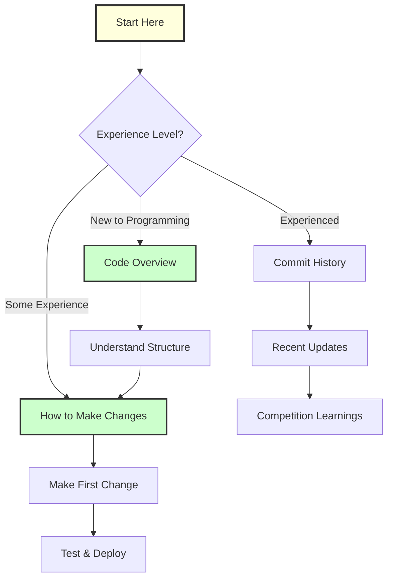

# 📚 Reefscape 2025 - Documentation Hub

Welcome to the comprehensive documentation for Team 3164 Stealth Tigers' 2025 FRC Robot!

## 🎯 Quick Navigation

### For New Team Members
Start here if you're new to the team or programming:

1. **[Code Overview](./code_overview.md)** - Complete guide to understanding the codebase
   - What each file does
   - How subsystems work together
   - Detailed diagrams and explanations

2. **[How to Make Changes](./how_to_make_changes.md)** - Practical guide for beginners
   - Step-by-step instructions
   - Common changes you'll make
   - Safety guidelines

### For Active Developers

3. **[Commit History Analysis](./commit_history_analysis.md)** - Recent changes explained
   - Last 10 commits in detail
   - What changed and why
   - Lessons learned from competition

4. **[General Notes](./general_notes.md)** - Quick reference notes
   - Important reminders
   - Known issues
   - Tips and tricks

5. **[Collision Detection](./collision_detection.md)** - Safety systems documentation
   - How collision detection works
   - Configuration and tuning

## 🗺️ Documentation Map



## 🚀 Quick Start Guide

### If you want to...

| Goal | Read This | Page |
|------|-----------|------|
| Understand the robot code | [Code Overview](./code_overview.md) | Full guide |
| Change robot speed | [How to Make Changes](./how_to_make_changes.md#1-changing-robot-speeds) | Section 1 |
| Add a button function | [How to Make Changes](./how_to_make_changes.md#3-adding-a-new-button-function) | Section 3 |
| Understand recent changes | [Commit History](./commit_history_analysis.md) | Full analysis |
| Learn about subsystems | [Code Overview](./code_overview.md#-subsystems-robot-parts) | Subsystems section |

## 📖 Document Descriptions

### [Code Overview](./code_overview.md)
**Perfect for:** Beginners, new team members  
**Contains:** 
- Complete codebase structure
- Subsystem explanations with diagrams
- Controller mappings
- Architecture overview
- Visual flowcharts

### [How to Make Changes](./how_to_make_changes.md)
**Perfect for:** Anyone making code changes  
**Contains:**
- Step-by-step tutorials
- Common modifications
- Safety checklists
- Testing procedures
- Code patterns to copy

### [Commit History Analysis](./commit_history_analysis.md)
**Perfect for:** Understanding recent work  
**Contains:**
- Detailed breakdown of last 10 commits
- Competition adjustments explained
- Before/after comparisons
- Lessons learned

## 🎓 Learning Path

### Week 1: Understanding
- [ ] Read [Code Overview](./code_overview.md)
- [ ] Explore the actual code files
- [ ] Run robot in simulation

### Week 2: First Changes
- [ ] Read [How to Make Changes](./how_to_make_changes.md)
- [ ] Make a simple constant change
- [ ] Test in simulation

### Week 3: Real Robot
- [ ] Deploy code to robot
- [ ] Test with robot on blocks
- [ ] Make a button mapping change

### Week 4: Autonomous
- [ ] Understand auto routines
- [ ] Modify an existing auto
- [ ] Create simple auto sequence

## 🔧 Key Files Quick Reference

```
src/
├── robot.py           # Main robot class
├── container.py       # Command central & button mappings
├── constants.py       # All adjustable values
├── swerve_config.py   # Drive system configuration
├── subsystems/
│   ├── elevator.py    # Vertical movement
│   ├── coral_arm.py   # Arm rotation
│   ├── claw.py        # Game piece control
│   ├── climber.py     # End game climbing
│   └── auto_align.py  # Automatic positioning
└── commands/
    └── swerve.py      # Drive commands
```

## 💡 Pro Tips

1. **Always test in simulation first** - Save time and prevent damage
2. **Make small changes** - Easier to debug
3. **Use version control** - Commit working code before changes
4. **Ask questions** - No question is too simple
5. **Document your changes** - Help future you

## 🚨 Important Reminders

- **Safety First** - Always have someone at the E-stop
- **Test Incrementally** - Small changes, test, repeat
- **Check SmartDashboard** - Monitor values while testing
- **Communicate** - Tell team what you're changing

## 📊 Documentation Stats

- **Total Documentation**: 4 comprehensive guides
- **Diagrams**: 30+ Mermaid diagrams
- **Code Examples**: 25+ examples
- **Topics Covered**: Architecture, changes, history, tutorials

## 🤝 Contributing to Docs

Help keep documentation updated:

1. Notice something wrong? Fix it!
2. Learned something new? Document it!
3. Found a better way? Share it!

### Documentation Standards
- Use Mermaid for diagrams
- Include code examples
- Explain "why" not just "what"
- Target high school level understanding

## 📞 Getting Help

- **Team Slack**: #programming channel
- **Mentors**: Available during meetings
- **Documentation**: You're reading it!
- **Code Comments**: Read inline documentation

## 🎯 Season Goals

- [x] Working swerve drive
- [x] Reliable autonomous
- [x] Competition-tested code
- [x] Comprehensive documentation
- [ ] State championship ready
- [ ] Worlds preparation

---

*"Code with confidence, test with caution, and document everything!"*

**Last Updated:** April 2025  
**Team 3164 - Stealth Tigers** 🐯