# Reefscape 2025 - Complete Codebase Documentation

## 🤖 What is This Project?

This is the robot code for Team 3164 Stealth Tigers' 2025 FRC (FIRST Robotics Competition) robot! The game this year is called **REEFSCAPE**, where robots compete to place CORAL pieces on a hexagonal REEF structure and perform other tasks. Think of it like a really advanced remote-controlled robot that can drive itself and score game pieces!

## 📁 Project Structure Overview


## 🎮 How the Robot Works - The Big Picture

### The Robot's Brain Structure


## 📂 Detailed File Structure

### Core Files

#### 1. **robot.py** - The Main Robot Brain
- **Location:** `src/robot.py`
- **Purpose:** This is the starting point! It's like the robot's main brain that controls everything
- **What it does:**
  - Starts the robot when you turn it on
  - Switches between different modes (autonomous, teleop, test)
  - Manages data logging for debugging
  - Creates the RobotContainer that holds all subsystems


#### 2. **container.py** - Command Central
- **Location:** `src/container.py`
- **Purpose:** This is where ALL the robot's parts come together!
- **What it does:**
  - Creates all subsystems (elevator, arms, drivetrain, etc.)
  - Maps controller buttons to robot actions
  - Builds autonomous routines
  - Manages the "superstructure" (coordinated movements)

### 🚗 Subsystems (Robot Parts)

Each subsystem is like a different part of your robot's body:


### Detailed Subsystem Breakdown

#### 1. **Swerve Drive System** (`swerve_config.py` + SwerveDrive library)

The coolest part! This robot can move in ANY direction without turning!


**Key Specifications:**
- Max Speed: 4.2 meters/second
- Wheel Base: 29.75 inches
- Track Width: 17.75 inches
- Each wheel can rotate 360° independently!

#### 2. **Elevator System** (`subsystems/elevator.py`)

Lifts the scoring mechanism up and down:

```mermaid
graph LR
    A[Controller Input] --> B[SetHeightCommand]
    B --> C[Elevator Motors<br/>IDs: 9, 10]
    C --> D[Carriage Movement]
    D --> E[Height Levels]
    
    E --> F[Level 0: 30.5"]
    E --> G[Level 1: 31"]
    E --> H[Level 2: 29.75"]
    E --> I[Level 3: 45.25"]
    E --> J[Level 4: 78.5"]
```

**Features:**
- Two NEO motors working together
- Soft limits prevent overextension
- Hall effect sensor for homing
- Range: 30.5" to 80" height

#### 3. **Coral Arm** (`subsystems/coral_arm.py`)

Rotates to place game pieces at different angles:

```mermaid
graph TD
    A[Arm Positions] --> B[Level 0: 0°]
    A --> C[Level 1-4: -35°]
    A --> D[Extended: 90°]
    
    E[Motor ID: 12] --> F[125:1 Gear Ratio]
    F --> G[14 inch arm length]
```



#### 4. **Claw System** (`subsystems/claw.py`)

Grabs and releases CORAL game pieces:


**Detection Method:**
- Monitors motor current
- High current + low speed = piece grabbed!
- Threshold: 15 Amps

#### 5. **Climber** (`subsystems/climber.py`)

End-game climbing mechanism:

```mermaid
graph LR
    A[Two Motors<br/>IDs: 13, 14] --> B[Synchronized Movement]
    B --> C[Rotation Limits<br/>76° to 153°]
```



### 🎮 Control System

#### Controller Mapping


### 🤖 Autonomous Routines

The robot can run pre-programmed routines:


### 📊 Constants and Configuration

#### Important Robot Measurements


### 🔧 Configuration Files

1. **constants.py** - All the important numbers
   - Motor IDs
   - Physical measurements
   - Speed limits
   - PID values

2. **swerve_config.py** - Drive system setup
   - Module positions
   - Encoder offsets
   - Speed parameters

3. **field.py** - Game field information
   - Scoring positions
   - Alliance flipping
   - Field dimensions

### 💡 How to Make Changes

#### Adding a New Button Function

1. Open `oi.py`
2. Add button definition
3. Open `container.py`
4. Map button to command in `configure_button_bindings()`

Example:
```python
# In oi.py
self.new_button = self.controller.a()

# In container.py
self.operator_joystick.new_button.onTrue(
    commands2.InstantCommand(lambda: print("Button pressed!"))
)
```

#### Adjusting Robot Speeds

1. Open `constants.py`
2. Find the relevant constant (e.g., `MAX_VELOCITY`)
3. Change the value
4. Redeploy code to robot

#### Modifying Autonomous

1. Open `container.py`
2. Find `build_autos_speed1()` or create new method
3. Use command groups to sequence actions
4. Add to auto chooser

### 🎯 Key Concepts for Beginners

#### Commands vs Subsystems

- **Subsystem**: A physical part of the robot (like the elevator)
- **Command**: An action that uses subsystems (like "move elevator to level 2")


#### Command Groups

Commands can be combined:
- **Sequential**: Do one thing, then another
- **Parallel**: Do multiple things at once
- **Race**: Do things until one finishes


### 🐛 Debugging Tips

1. **SmartDashboard**: Shows live data from robot
2. **Data Logs**: Recorded in robot.py
3. **Simulation**: Test without physical robot
4. **Print Statements**: Use `commands2.PrintCommand()`

### 📈 Performance Metrics

- **Loop Time**: 20ms (50Hz)
- **CAN Bus Usage**: Monitor in Driver Station
- **Battery Voltage**: Keep above 11V
- **Motor Temperatures**: Watch for overheating

## 🚀 Getting Started with Code Changes

### Basic Workflow

1. Make changes in your editor
2. Deploy to robot (when connected)
3. Test in disabled mode first
4. Enable and test carefully
5. Check SmartDashboard for errors

### Safety First!

- Always have someone ready to disable robot
- Test new code with robot on blocks
- Start with low speeds
- Check motor directions before full test

## 📚 Where to Learn More

- **WPILib Docs**: Official FRC programming guide
- **Team Documentation**: This folder!
- **Code Comments**: Read the inline documentation
- **Ask Mentors**: They're here to help!

---

*Remember: Every expert programmer started as a beginner. Don't be afraid to ask questions and experiment (safely)!*