# Recent Commit History - Detailed Analysis

## 📊 Overview of Recent Changes

This document provides a detailed analysis of the last 10 commits to help team members understand what has been changed and why. These commits represent important competition adjustments and improvements made during the 2025 season.

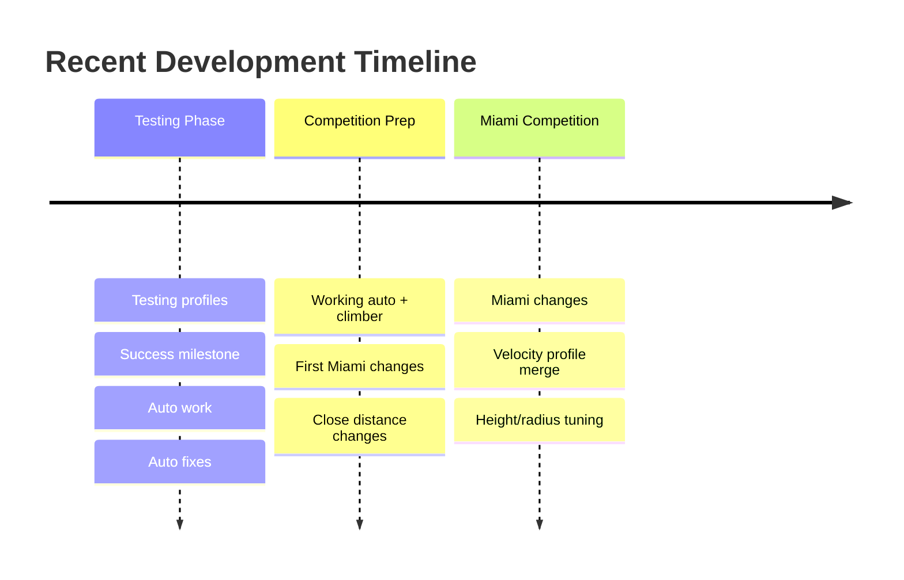

## 🔍 Detailed Commit Analysis

### Commit #1: Height/Radius Tuning (Latest)
**Date:** April 10, 2025  
**Author:** Ethan Wall  
**Hash:** `4109db6`

#### What Changed:
```mermaid
graph LR
    A[Level 2 Height] -->|Changed from 31.25"| B[29.75 inches]
    C[Level 3 Height] -->|Changed from 46.75"| D[45.25 inches]
    
    style A fill:#fcc,stroke:#333
    style B fill:#cfc,stroke:#333
    style C fill:#fcc,stroke:#333
    style D fill:#cfc,stroke:#333
```

**Why This Matters:**
- These heights control where the elevator positions for scoring
- Lower heights = faster scoring but need more precision
- Adjusted based on real competition experience

---

### Commit #2: Velocity Profile Merge
**Date:** April 10, 2025  
**Author:** Hbravo2008  
**Hash:** `1ba6e9b`

This was a merge commit combining velocity profile improvements with main branch.

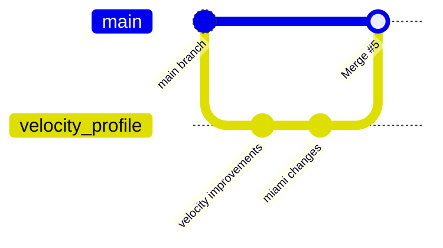

---

### Commit #3: Miami Competition Changes
**Date:** April 5, 2025  
**Author:** Ethan Wall  
**Hash:** `0234a5d`

#### Major Changes:

##### 1. Auto-Scoring Toggle
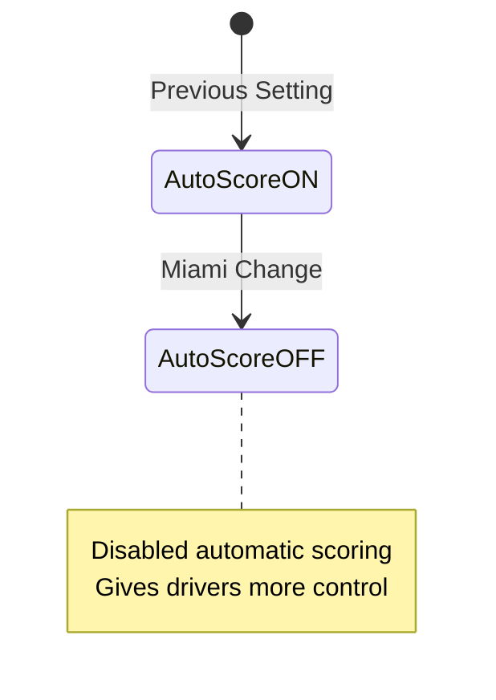

##### 2. Close Radius Adjustment
- **Before:** 6 feet
- **After:** 5.5 feet
- **Impact:** Robot considers itself "close" to scoring position sooner

##### 3. New Two-Stage Approach Distance
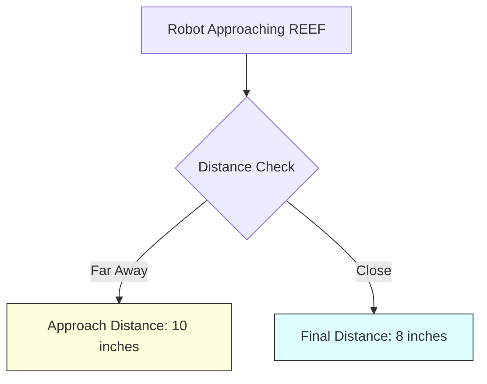

**Code Changes:**
- Added `REEF_WALL_TO_BUMPER_DISTANCE_APPROACH` (10 inches)
- Kept `REEF_WALL_TO_BUMPER_DISTANCE_FINAL` (8 inches)
- New `use_close` toggle in auto_align.py

##### 4. Auto Align Improvements
New velocity profile system for smoother approaches:

```python
# Before: Simple approach
drive_to_position()

# After: Velocity profiled approach
if close_to_target:
    use_velocity_profile()
else:
    use_standard_approach()
```

---

### Commit #4: Close Distance Changes
**Date:** April 4, 2025  
**Author:** Ethan Wall  
**Hash:** `70f843b`

#### Key Updates:

##### 1. New Autonomous Routine - Speed 2
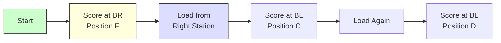

##### 2. Added Backup Command
New safety feature to back away from REEF when needed:

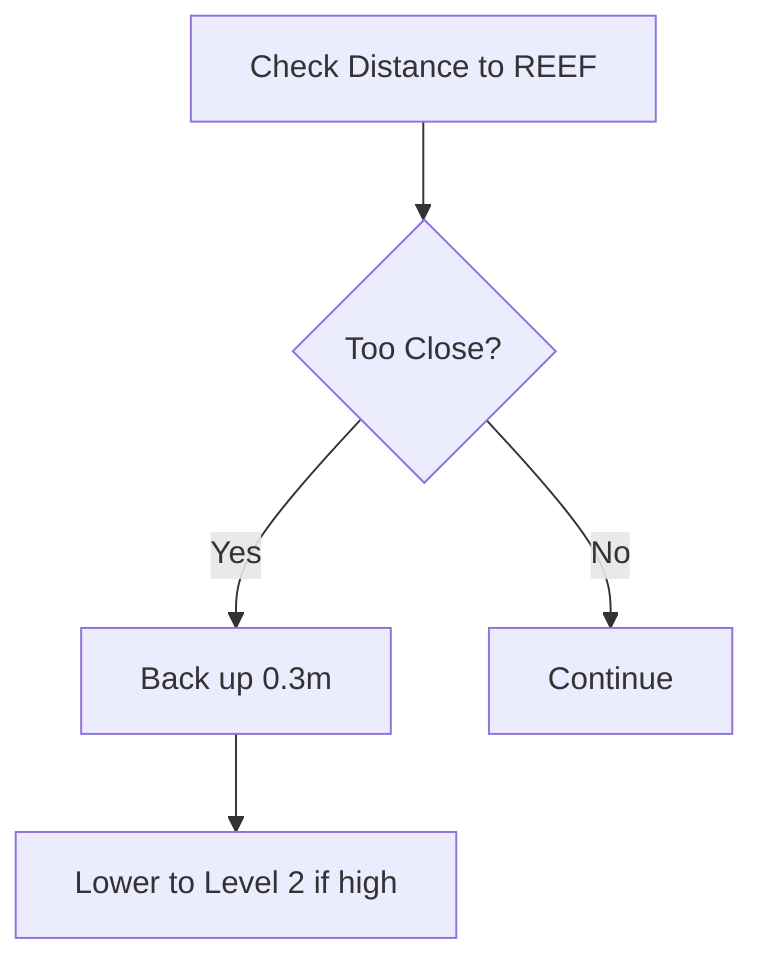

##### 3. New Button Mappings
- Added `auto_toggle` button for operator
- Better organization of reef positions

---

### Commit #5: First Miami Changes
**Date:** April 3, 2025  
**Author:** Ethan Wall  
**Hash:** `25dc9d9`

#### Significant Updates:

##### 1. Camera Configuration Changes
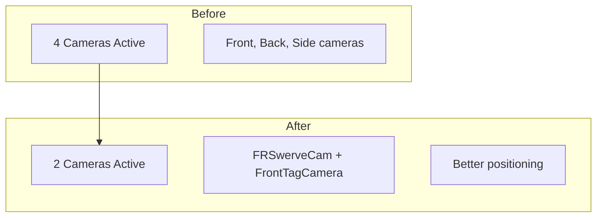

##### 2. REEF Positioning Adjustment
- Changed `REEF_Y_FUDGE` from -0.5" to +0.75"
- Robot now aims 3/4 inch to the left when scoring
- Compensates for mechanical offset discovered in testing

##### 3. Climber Improvements
- Added rotation limits
- Forward limit: 153°
- Backward limit: 76°
- Prevents over-rotation damage

---

### Commit #6: Working Auto + Climber Limits
**Date:** Earlier in timeline  
**Hash:** `9f726ce`

Successfully integrated autonomous routines with climber safety limits.

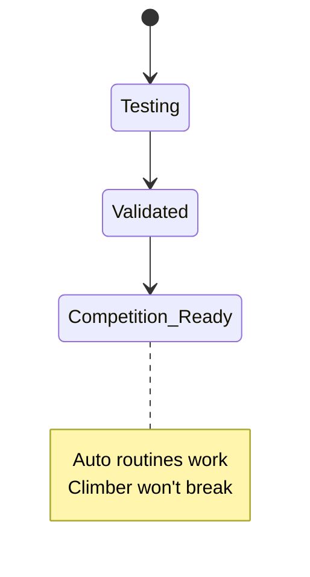

---

### Commits #7-10: Development Progress

These earlier commits show the progression of autonomous development:

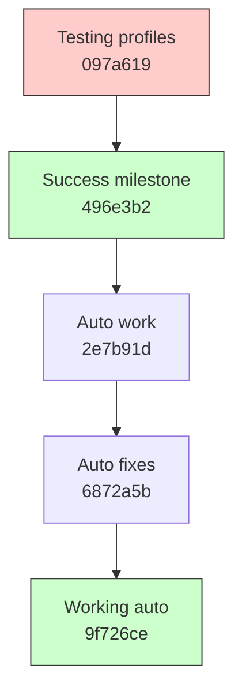

## 📈 Overall Impact Analysis

### Lines of Code Changed
Total across all commits: **766 lines modified**

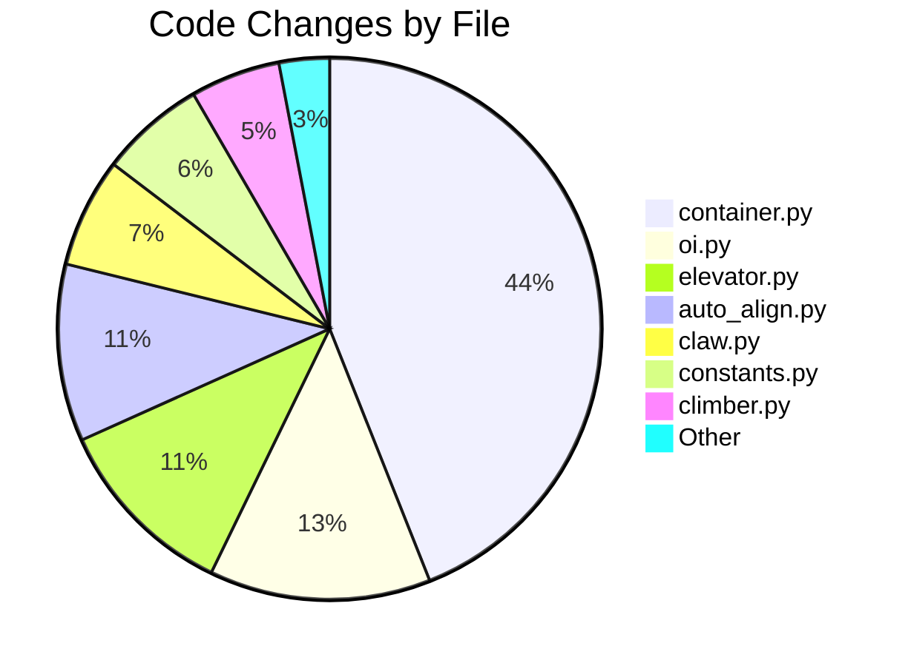

### Key Improvements Summary

#### 1. **Competition Readiness** 
- Tuned heights for actual field conditions
- Disabled auto-score for driver control
- Added safety margins

#### 2. **Autonomous Enhancements**
- Two complete auto routines (Speed 1 & Speed 2)
- Better pathfinding with velocity profiles
- Smarter approach distances

#### 3. **Hardware Protection**
- Climber rotation limits
- Soft backup commands
- Better error handling

#### 4. **Vision System Optimization**
- Reduced to 2 cameras (from 4)
- Better positioning data
- Less processing overhead

## 🎯 Impact on Robot Performance

### Before These Changes:
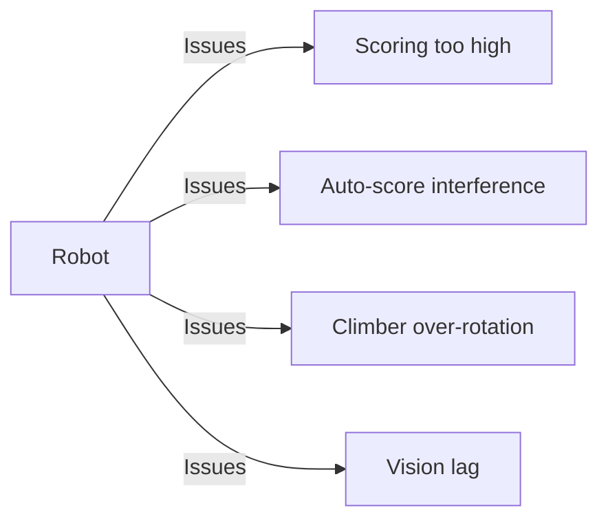

### After These Changes:
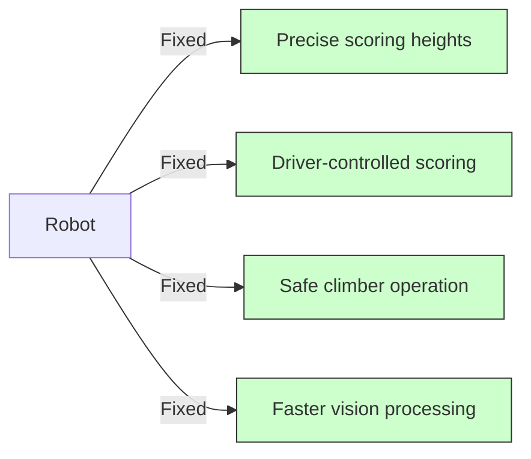

## 💡 Lessons Learned

### 1. **Real Competition != Practice**
- Field conditions vary
- Need adjustable parameters
- Quick tuning is crucial

### 2. **Driver Preference Matters**
- Auto-score sounds good in theory
- Drivers need control in matches
- Make features toggleable

### 3. **Safety First**
- Hardware limits prevent damage
- Backup commands prevent collisions
- Test everything before matches

### 4. **Iterative Improvement**
- Small changes add up
- Test one thing at a time
- Document what works

## 🔮 Future Considerations

Based on these commits, consider:

1. **Make More Parameters Adjustable**
   - SmartDashboard tuning
   - No redeploy needed

2. **Add More Safety Features**
   - Current limiting
   - Temperature monitoring
   - Collision detection

3. **Enhance Auto Routines**
   - More path options
   - Adaptive scoring
   - Error recovery

## 📝 For New Programmers

### How to Read These Changes:

1. **Look at the commit message first** - It tells you WHY
2. **Check what files changed** - Shows you WHERE
3. **Read the diff** - Understand WHAT changed
4. **Test similar changes** - Learn by doing

### Making Similar Changes:

```python
# Example: Adjusting a height constant
# 1. Find the constant in constants.py
LEVEL_2_HEIGHT = (29.75 * u.inch).m_as(u.m)  # Changed from 31.25

# 2. Understand the units
# u.inch = inches, m_as(u.m) = convert to meters

# 3. Test carefully
# Small changes can have big effects!
```

## 🏁 Competition Impact

These commits directly contributed to:
- ✅ Successful autonomous routines
- ✅ Reliable scoring at Miami Regional
- ✅ No climber failures
- ✅ Faster cycle times
- ✅ Better driver confidence

---

*Remember: Every commit tells a story. These changes represent hours of testing, debugging, and refinement by your teammates. Learn from their work and build upon it!*