# 🛠️ How to Make Changes - A Beginner's Guide

## 🎯 Quick Start - Your First Change

### The 5-Step Process


## 📚 Common Changes You'll Make

### 1. Changing Robot Speeds

**Scenario:** "The robot is moving too fast/slow"


#### Example: Slowing Down Drive Speed

**File:** `src/swerve_config.py`

```python
# BEFORE - Too fast!
MAX_VELOCITY = 4.2 * (u.m / u.s)  # 4.2 meters per second

# AFTER - More controllable
MAX_VELOCITY = 3.0 * (u.m / u.s)  # 3.0 meters per second
```

**What the units mean:**
- `u.m` = meters
- `u.s` = seconds
- `u.inch` = inches
- `u.deg` = degrees

---

### 2. Adjusting Scoring Heights

**Scenario:** "The elevator isn't going to the right height for scoring"


#### Example: Adjusting Level 2 Height

**File:** `src/constants.py`

```python
class ElevatorConstants:
    # BEFORE - Too high
    LEVEL_2_HEIGHT = (31.25 * u.inch).m_as(u.m)
    
    # AFTER - Just right!
    LEVEL_2_HEIGHT = (29.75 * u.inch).m_as(u.m)
```

**Pro Tip:** Measure the actual height needed with a tape measure first!

---

### 3. Adding a New Button Function

**Scenario:** "I want button B to do something new"


#### Step-by-Step Example: Make B Button Do a Dance

**Step 1:** Check if button exists in `src/oi.py`
```python
class XboxOperator:
    def __init__(self, port: int):
        self.controller = CommandXboxController(port)
        # ... other buttons ...
        self.level_3 = self.controller.b()  # B button already defined!
```

**Step 2:** Create your command (or use existing one)
```python
# Simple instant command
dance_command = commands2.InstantCommand(
    lambda: print("Robot is dancing! 🕺")
)

# Or use existing command
dance_command = self.coral_arm.SetAngleCommand(
    Rotation2d.fromDegrees(45)
)
```

**Step 3:** Map it in `src/container.py`
```python
def configure_button_bindings(self):
    # Find this method and add:
    self.operator_joystick.level_3.onTrue(
        commands2.PrintCommand("Dancing!").alongWith(
            self.coral_arm.SetAngleCommand(Rotation2d.fromDegrees(45))
        )
    )
```

---

### 4. Modifying Autonomous Routines

**Scenario:** "Change the auto to score in different positions"


#### Example: Changing Scoring Position in Auto

**File:** `src/container.py`

```python
def build_autos_speed1(self):
    # BEFORE - Scores at position "i"
    DriveToScoringPosition(self.aa, "i", AUTONOMOUS_PARAMS)
    
    # AFTER - Scores at position "k" instead
    DriveToScoringPosition(self.aa, "k", AUTONOMOUS_PARAMS)
```

**Reef Positions Map:**

```mermaid
graph TD
    subgraph "REEF Layout (Top View)"
        K[K 🔷] --- L[L 🔶]
        L --- A[A 🔷]
        A --- B[B 🔶]
        B --- C[C 🔷]
        C --- D[D 🔶]
        D --- E[E 🔷]
        E --- F[F 🔶]
        F --- G[G 🔷]
        G --- H[H 🔶]
        H --- I[I 🔷]
        I --- J[J 🔶]
        J --- K
    end
    
    style A fill:#bbf,stroke:#333
    style C fill:#bbf,stroke:#333
    style E fill:#bbf,stroke:#333
    style G fill:#bbf,stroke:#333
    style I fill:#bbf,stroke:#333
    style K fill:#bbf,stroke:#333
```


---

### 5. Adjusting Motor Power

**Scenario:** "The claw motor needs more/less power"

#### Example: Changing Claw Intake Speed

**File:** `src/subsystems/claw.py`

```python
def intake(self):
    # BEFORE - Too slow
    self.motor.set(0.2)  # 20% power
    
    # AFTER - Faster intake
    self.motor.set(0.35)  # 35% power
```

**Power Scale:**
- `1.0` = Full forward (100%)
- `0.5` = Half forward (50%)
- `0.0` = Stopped
- `-0.5` = Half reverse
- `-1.0` = Full reverse

---

## 🔍 Finding What to Change

### Use This Decision Tree:


### Quick File Reference:

| If you want to change... | Look in this file... | For this class/section... |
|-------------------------|---------------------|------------------------|
| Drive speed | `swerve_config.py` | `MAX_VELOCITY` |
| Elevator heights | `constants.py` | `ElevatorConstants` |
| Button mappings | `container.py` | `configure_button_bindings()` |
| Motor IDs | `constants.py` | Various `*Constants` classes |
| Auto routines | `container.py` | `build_autos_*()` methods |
| Claw behavior | `subsystems/claw.py` | `intake()`, `outtake()` |
| Arm angles | `constants.py` | `CoralArmConstants` |

---

## ⚠️ Safety Checklist

### Before Making Changes:

```mermaid
flowchart TD
    A[Before Changing Code] --> B{Safety Check}
    B --> C[✓ Understand what it does]
    B --> D[✓ Know normal values]
    B --> E[✓ Have robot on blocks]
    B --> F[✓ Someone at E-stop]
    B --> G[✓ Test small changes first]
    
    style B fill:#ffd,stroke:#f00,stroke-width:3px
```



### Red Flags - Don't Change These Without Help:

1. **Motor Inversion** (`INVERT_*` constants)
   - Wrong = robot drives backward!
   
2. **Gear Ratios** (`GEAR_RATIO`)
   - Wrong = incorrect speeds/positions
   
3. **Sensor IDs** (CAN IDs, DIO ports)
   - Wrong = motors won't work
   
4. **PID Values** (`kP`, `kI`, `kD`)
   - Wrong = oscillation or instability

---

## 🧪 Testing Your Changes

### The Testing Pyramid:


### How to Test Safely:

#### 1. **Simulation Testing** (No robot needed!)
```bash
# Run the simulator
python robot.py simulate
```

#### 2. **On-Blocks Testing**
- Put robot on blocks (wheels off ground)
- Deploy code
- Enable in teleop
- Test at low speeds first

#### 3. **SmartDashboard Monitoring**
Check these values while testing:
- Motor temperatures
- Current draw
- Battery voltage
- Error messages

---

## 💻 Deploying Code to Robot

### Step-by-Step Deployment:


### Deploy Command:
```bash
# Make sure you're connected to robot WiFi first!
python robot.py deploy
```

### Common Deployment Issues:

| Problem | Solution |
|---------|----------|
| Can't connect to robot | Check WiFi - should be "3164" network |
| Code won't deploy | Check for syntax errors |
| Robot disabled itself | Check driver station for errors |
| Changes don't appear | Did you save the file? |

---

## 📝 Code Patterns to Copy

### Pattern 1: Creating a Simple Command

```python
# Template for a new command
def MyNewCommand(self):
    return commands2.InstantCommand(
        lambda: self.subsystem.do_something(),
        self.subsystem  # Required subsystem
    ).withName("MyNewCommand")
```

### Pattern 2: Sequential Actions

```python
# Do multiple things in order
commands2.SequentialCommandGroup(
    self.first_action(),     # Do this first
    commands2.WaitCommand(1), # Wait 1 second
    self.second_action(),    # Then do this
)
```

### Pattern 3: Parallel Actions

```python
# Do multiple things at once
commands2.ParallelCommandGroup(
    self.elevator.move_up(),  # These happen
    self.arm.extend(),        # at the same
    self.claw.intake(),       # time!
)
```

### Pattern 4: Conditional Commands

```python
# Do something based on a condition
commands2.ConditionalCommand(
    self.do_if_true(),        # If condition is true
    self.do_if_false(),       # If condition is false  
    lambda: self.check_something()  # The condition to check
)
```

---

## 🎓 Learning Resources

### Start Here:
1. **Read existing code** - Best way to learn patterns
2. **Make small changes** - Change one number at a time
3. **Ask questions** - No question is too simple!
4. **Use print statements** - `commands2.PrintCommand("Debug info")`

### Useful Debug Commands:

```python
# Print to console
commands2.PrintCommand("Robot reached position!")

# Print a value
commands2.InstantCommand(
    lambda: print(f"Elevator height: {self.elevator.carriage_height()}")
)

# Log to SmartDashboard
wpilib.SmartDashboard.putNumber("My Value", 123)
```

---

## 🚀 Your First Project Ideas

### Beginner Projects:
1. ✅ Adjust a scoring height by 1 inch
2. ✅ Change drive speed for practice
3. ✅ Add a print statement when scoring

### Intermediate Projects:
1. 📝 Create a new button combination
2. 📝 Modify an auto routine path
3. 📝 Add SmartDashboard values

### Advanced Projects:
1. 🏆 Create a new autonomous routine
2. 🏆 Implement a new subsystem
3. 🏆 Add sensor feedback loops

---

## ❓ FAQ

**Q: I broke something! What do I do?**
A: Don't panic! Use git to revert: `git checkout -- filename`

**Q: How do I know what values are safe?**
A: Check the current values first, make small changes (10-20%)

**Q: The robot isn't doing what I expect?**
A: Add print statements, check SmartDashboard, verify deployment

**Q: Can I test without the robot?**
A: Yes! Use simulation mode: `python robot.py simulate`

---

*Remember: Every expert was once a beginner. Start small, test often, and don't be afraid to ask for help! 🤖*